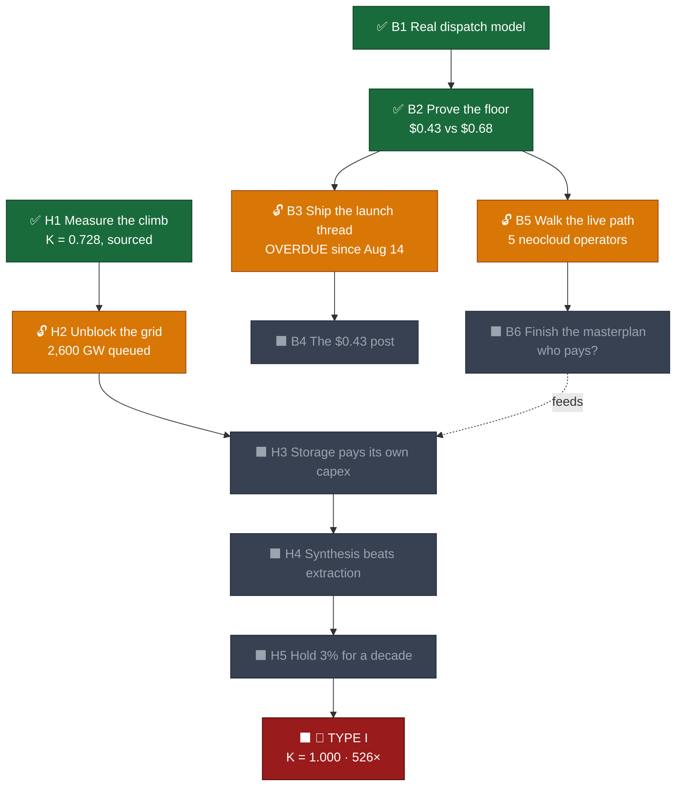

# 🗺️ QUESTBOOK: THE KARDASHEV CLIMB

Humanity's energy game, scored honestly. The board state is computed, not
vibed: **K = 0.728**, 19.02 TW continuous, 600.3 EJ in 2025 (Energy
Institute Statistical Review 2026 via OWID). The live tracker is
[kardashev.html](kardashev.html).

**Win condition: Type I. K = 1.000, 10¹⁶ W.** That is **526×** today's
output. At 2025's real growth rate the run does not finish in any player's
lifetime, and the questbook says so rather than pretending otherwise. The
point of the book is not to finish the run. It is to know which rung is
actually blocking, and to make the next one arrive sooner.

Thesis (Adam, 2026-08-24): climb Kardashev for humanity's good, and to
power AI.

---

## 🌳 THE TECH TREE

🟢 done · 🟠 unlocked, playable now · ⬛ locked · 🔴 boss

---

## 🕰️ THE RUNGS

Fog of war is the design. Each rung is 10× the last, so only the current
one gets real quests. Years assume constant compound growth, which is an
assumption and not a forecast.

| Rung | Power | vs today | at 2% | at 3% |
|---|---|---|---|---|
| **K 0.728** (now) | 19.02 TW | 1× | 2026 | 2026 |
| ⚔️ **K 0.8** | 100 TW | 5.26× | ~2110 | ~2082 |
| ⬛ **K 0.9** | 1 PW | 52.6× | ~2226 | ~2160 |
| ⬛ **👑 K 1.0** | 10 PW | 526× | ~2342 | ~2238 |

The whole industrial era, Standard Oil through Insull through Aramco
through Tesla, fits inside 0.12 K (1900: 0.614, 2025: 0.731). The log
scale flatters us badly: 72.8% of the climb by exponent is 0.19% of the
power.

**The only lever in the table is the growth rate.** 2% finishes in 2342.
3% finishes in 2238. One point of sustained growth is worth a century.

---

## ⚔️ MAIN QUESTLINE (humanity's)

- ✅ **H1. Measure the climb honestly** : DONE. K = 0.728 computed from
  the EI Statistical Review 2026 via OWID, formula and assumptions
  published, cross-checked against kardashev1.com's independent
  0.730 ± 0.02 (our commercial-only figure sits inside their band;
  biomass-inclusive lands on 0.730 exactly).
  Reward: the board has a real score. Every quest below can now be
  checked against a number instead of argued about.

- 🔓 **H2. Unblock the grid** : The binding constraint is not generation,
  it is connection. ~2,600 GW sits in the US interconnection queue (about
  twice the installed US grid), median waits run 5 to 12 years, large
  transformers run 128-week lead times, and roughly 90% of queued projects
  never come online.
  Objective: US median interconnection wait under 2 years AND queue-to-
  operational conversion above 25%. Checkable annually against LBNL's
  "Queued Up" and the Enverus queue outlook.
  Reward: new generation can physically reach load. Until this clears,
  every quest below is theoretical, because the power has nowhere to go.

- ⬛ **H3. Make storage pay for its own hardware** : Locked behind H2.
  Today a home battery run on a real ERCOT day earns **$0.43/day** on
  energy-only arbitrage against **$0.68/day** of amortized capex at the
  cheapest plausible hardware cost ($150/kWh over 15 years). Verified, not
  estimated: [dispatch/capex.go](dispatch/capex.go).
  Objective: arbitrage plus services revenue exceeds amortized capex on a
  normal (not volatile) day, with no subsidy and no bundled retail plan.
  Reward: storage stops being a thing that needs a business model wrapped
  around it and becomes a thing that pays for itself. Intermittent
  generation gets a spine.

- ⬛ **H4. Make synthesis beat extraction** : Locked behind H3. Terraform
  targets $1/kg green hydrogen and currently reports under $2.50/kg,
  deliberately running inefficient electrolyzers (~80 kWh/kg vs ~50 for
  best-in-class) because cheap capex at low duty cycle beats efficiency
  when the electrons are nearly free. The open critique: 50-90% of modeled
  revenue is IRA production tax credits, which sunset by 2032.
  Objective: synthetic hydrocarbon delivered at or under fossil parity
  with the tax credits switched off.
  Reward: hydrocarbons become manufacturable anywhere there is sun and
  air. Energy decouples from geology, which is the single biggest
  structural unlock on the board.

- ⬛ **H5. Hold 3% for a decade** : Locked behind H4. 2025's actual growth
  was 1.7%.
  Objective: world primary energy sustains ≥3%/yr for 10 consecutive
  years, per the EI Statistical Review series.
  Reward: Type I lands around 2238 instead of 2342. A century, bought with
  one percentage point.

- ⬛ **👑 BOSS: TYPE I** : K = 1.000. 10¹⁶ W. 526× today.
  Not winnable by any player currently holding this book. Named anyway,
  because a run without a real end state is just a todo list.

---

## 🔧 THE BUILDER'S CHAIN (Adam's, playable now)

The quests above are humanity's and move on a scale of decades. These are
the ones with a keyboard attached.

- ✅ **B1. Build a real dispatch model** : DONE. Go planner, single-cycle,
  efficiency-gated, refuses to cycle when the spread does not clear
  round-trip losses. Runs on a real captured ERCOT day, not a synthetic
  one. 14 tests passing.

- ✅ **B2. Prove the floor honestly** : DONE 2026-08-24, shipped as
  d225d0d. The capex model returns a negative result and publishes it:
  energy-only arbitrage does not cover hardware cost at any plausible
  capex. Most people would have buried this. It is the most credible thing
  on the site.
  Reward: earned the right to make claims about storage economics, because
  the first real claim made was against interest.

- 🔓 **B3. Ship the launch thread** : **OVERDUE since 2026-08-14 20:00.**
  Post 1/14. Text is written and waiting. Dispatch chart screenshot in
  post 1, repo link in reply.
  Objective: posted, plus replies to 3-5 build-in-public accounts.
  Reward: the work stops being invisible. Nothing else in this chain
  compounds until something is public.

- ⬛ **B4. The $0.43 post** : Locked behind B3, literally, it is a reply in
  the same thread and cannot precede it.
  Objective: posted with the chart, plus 3-5 more builder replies.

- 🔓 **B5. Walk the live path** : The idea maze named exactly one branch
  that a funded incumbent is not already sitting on: dispatch and
  curtailment software for **mid-scale neocloud operators, 5-50 MW GPU
  clusters**, too small for Emerald AI or AutoGrid's enterprise motion,
  too specialized for Base Power's residential product. Graded
  **unverified**, not confirmed open.
  Objective: talk to 3-5 real neocloud/GPU-cluster operators and find out
  whether that gap is real or whether there is a good reason nobody built
  it. No code first.
  Reward: converts the maze's one open branch into either a real market or
  a closed door. Both outcomes are wins; only guessing is a loss.

- ⬛ **B6. Finish the masterplan** : Locked behind B5, because the answer
  depends on what B5 finds.
  Two questions are still genuinely unanswered as of 2026-08-24:
  **who pays** (answered "I don't know yet"), and **what the standing
  discipline is** (not yet answered). Until both have answers,
  megawatt.fun has a thesis and a scope guard but no business model, and
  this questbook deliberately does not invent one.

---

## 📜 RULES OF PLAY

- ⬛ Locked quests stay locked. H3 genuinely cannot be solved before H2,
  because storage with nowhere to connect is not storage.
- **The book suggests, it never gates.** Ignoring this file and doing the
  real thing anyway is always correct.
- **Every number here is checkable.** K = 0.728, $0.43/day, $0.68/day,
  526×, 2,600 GW, 80 kWh/kg. If a number cannot be sourced, it does not
  belong in this file. Replace it or delete it, never round it up.
- **Negative results ship.** B2 is on the board as a completed quest
  specifically because it found bad news and published it. That rule
  applies to every quest below it.
- **Fog of war.** K 0.9 and K 1.0 get a row in the table and nothing more.
  Writing detailed quests for a rung 200 years out would be fiction.
- **Humanity's chain is not Adam's chain.** H2 through H5 are gates
  civilization has to pass, tracked here because knowing which one binds
  is useful. Confusing them with personal todos is the failure mode this
  split exists to prevent.

---

*Board state as of 2026-08-24. Sources: Energy Institute Statistical
Review (2025, 2026 via OWID), Smil (2017) via OWID, Gray (2020), LBNL
Queued Up, Enverus 2026 Interconnection Queue Outlook, kardashev1.com,
and this repo's own dispatch/capex.go.*
